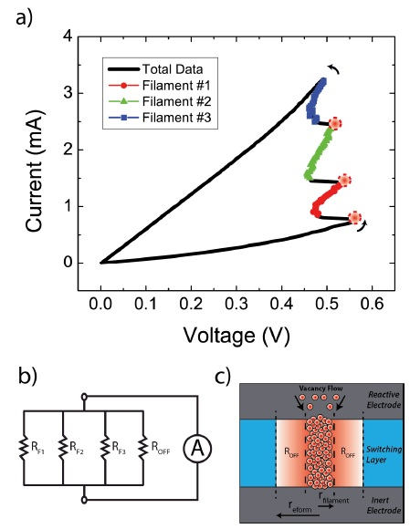
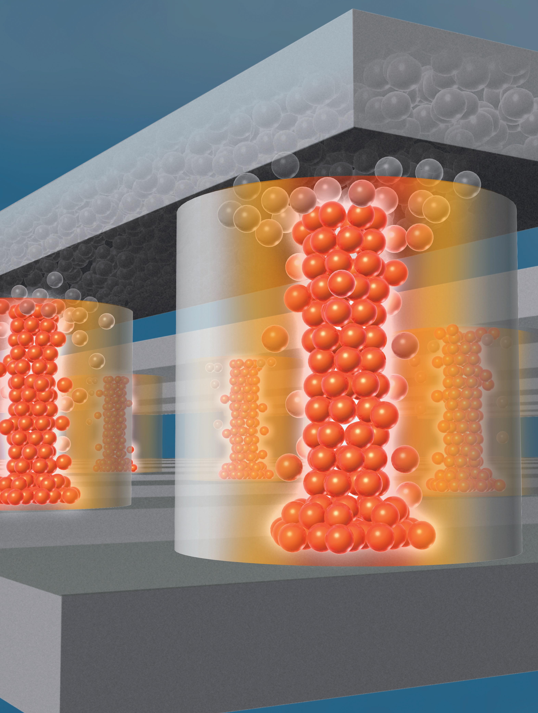
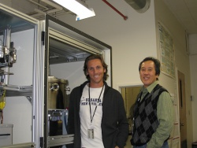
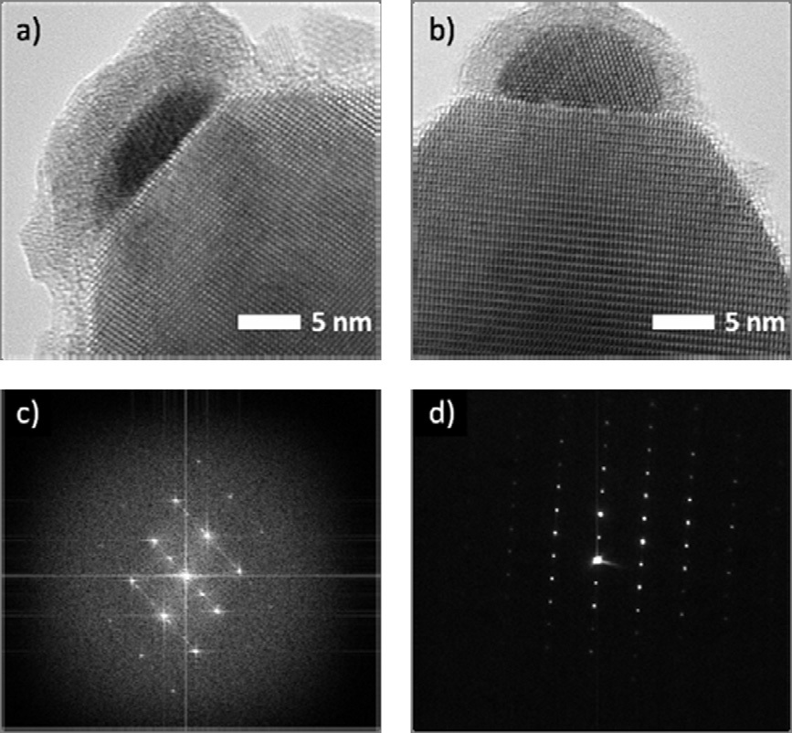

<table>
<tr>
  <td width="30%"><b>Cybersecurity</b> 
     
    Black Hat Talk  
    <ul>
      <li>Taught Offensive Security Course</li>
      <li>Mathed out the failure modes of cyber capabilities and operations</li>
      <li>Learned that some cyber ninjas are fantastic and others (like me) are just meh</li>
  </td>
  <td width="30%"><b>Artificial Intelligence</b> 
     
    Downscaling attacks on AI libraries  
    <ul>
      <li>Taught practical AI development course</li>
      <li>Built and probee models to test for security and misuse</li>
      <li>Am constantly awed by the power that other people's genius has put in my fingertips</li>
  </td>
  <td width="30%"><b>Geopolitics</b> 
     
    Senate Armed Services Testimony  
    <ul>
      <li>Faculty member in Georgetown's School of Foreign Service</li>
      <li>Talk with lots of people who have very hard jobs</li>
      <li>Experienced the horror of knowing how little we know about important things</li>
    </ul>
  </td>
</tr>
<tr>
<td><b>Drone Logistics</b>
   
  Uber Elevate Presentation  
    <ul>
      <li>Calculated externalities of drone delivery at scale</li>
      <li>Presented for World Econonic Forum and Uber's flying taxi conferencec</li>
      <li>Didn't fly in a flying taxi</li>
    </ul>
</td>
  <td><b>Electrical Engineering</b> 
    
    Weird circuit behavior we discovered  
    <ul>
      <li>Taught electronic circuits course</li>
      <li>Designed, fabricated, and tested electronic memories, solar cells and thermoelectrics</li>
      <li>Found that the business side is the hard part of technology</li>
    </ul>
  </td>
  <td><b>VR Game Design</b>
    <ul>
      <li>Designed, coded, and played VR game in Unity</li>
      <li>Used my laser vision and teleportation to reach level 7</li>
      <li>Didn't vomit!</li>
    </ul>
</td>
</tr>
<tr>
  <td><b>Physics</b>
     
    Cool physics in a not physics journal  
    <ul>
      <li>Published a bunch in 8 different physics journals</li>
      <li>Used math to discover surprising behavior in the real world</li>
      <li>Found real beauty in the world's hidden simplicity</li>
    </ul>
</td>
  <td><b>Chemistry</b>
     
    A gas-phase chemical reactors I built  
    <ul>
      <li>Built a crystal growth lab at NASA</li>
      <li>Spent years getting all the flows and temperatures just right</li>
      <li>Learned that chemistry is black magic</li>
    </ul>
</td>
  <td><b>Nanotechnology</b>
     
    Atoms in a nanowire  
    <ul>
      <li>Made TINY materials and devices</li>
      <li>Did all the cool atom-scale microscopes and x-rays and laser stuffs</li>
      <li>Eventually fixed all the things I broke</li>
    </ul>
  </td>
</tr>
</table>

<a href="https://scholar.google.com/citations?user=gwBUOaUAAAAJ&hl=en">Publications</a> 
<a href="https://patents.google.com/?inventor=Andrew+Lohn&oq=Andrew+Lohn">Patents</a> 
