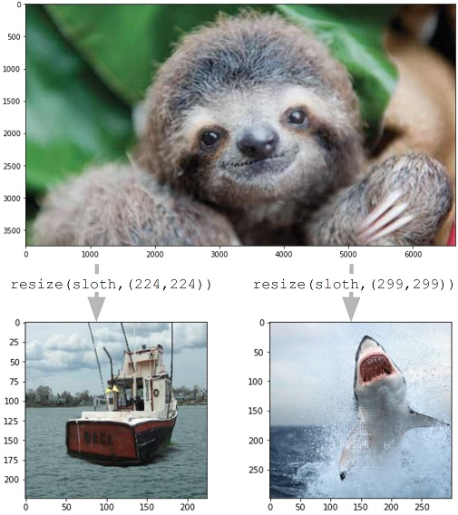

<table>
<tr>
  <td width="30%"><b>Cybersecurity</b><br>
    <br>
    Black Hat Talk<br>
    <ul>
      <li>Taught Offensive Security Course</li>
      <li>Math and stats for reliability of cyber capabilities and operations</li>
      <li>Capture the flag to categorize failure modes of offensive operations</li>
  </td>
  <td width="30%"><b>Artificial Intelligence</b><br>
    <br>
    Downscaling attacks on AI libraries<br>
    <ul>
      <li>Taught practical AI development course</li>
      <li>Build and probe models to test for security and misuse</li>
      <li>Write about scaling of future AI models</li>
  </td>
  <td width="30%"><b>Geopolitics</b><br>
    <br>
    Senate Armed Services Testimony<br>
    <ul>
      <li>Faculty member in Georgetown's School of Foreign Service</li>
      <li>Former member of OECD Compute and Climate Task Force</li>
      <li>Study international competition over technology</li>
    </ul>
  </td>
</tr>
<tr>
<td><b>Drone Logistics</b>
  <br>
  Uber Elevate Presentation
    <ul>
      <li>Calculated externalities of drone delivery at scale</li>
      <li>Presented for World Econonic Forum</li>
      <li>Presented for Uber's flying taxis conference</li>
    </ul>
</td>
  <td><b>Electrical Engineering</b>
    <ul>
      <li>Taught electronic circuits course</li>
      <li>Designed, fabricated, and tested electronic memories</li>
      <li>Designed, fabricated, and tested solar and thermal devices</li>
    </ul>
  </td>
  <td><b>VR Game Design</b>
    <ul>
      <li>Designed, coded, and played VR game in Unity</li>
      <li>Used my laser vision and teleportation to reach level 7</li>
      <li>Didn't vomit!</li>
    </ul>
</td>
</tr>
<tr>
  <td><b>Physics</b>
    <ul>
      <li>Published a bunch in 8 different physics journals</li>
      <li>Used math to discover surprising behavior in the real world</li>
      <li>Found real beauty in the world's hidden simplicity</li>
    </ul>
</td>
  <td><b>Chemistry</b>
    <ul>
      <li>Built a crystal growth lab at NASA</li>
      <li>Spent years getting all the flows and temperatures just right</li>
      <li>Learned that chemistry is black magic</li>
    </ul>
</td>
  <td><b>Nanotechnology</b>
    <ul>
      <li>Made TINY materials and devices</li>
      <li>Did all the cool atom-scale microscopes and x-rays and laser stuffs</li>
      <li>Eventually fixed all the things I broke</li>
    </ul>
  </td>
</tr>
</table>


## Welcome to GitHub Pages

You can use the [editor on GitHub](https://github.com/drewlohn/drewlohn/edit/gh-pages/index.md) to maintain and preview the content for your website in Markdown files.

Whenever you commit to this repository, GitHub Pages will run [Jekyll](https://jekyllrb.com/) to rebuild the pages in your site, from the content in your Markdown files.

### Markdown

Markdown is a lightweight and easy-to-use syntax for styling your writing. It includes conventions for

```markdown
Syntax highlighted code block

# Header 1
## Header 2
### Header 3

- Bulleted
- List

1. Numbered
2. List

**Bold** and _Italic_ and `Code` text

[Link](url) and 
```

For more details see [Basic writing and formatting syntax](https://docs.github.com/en/github/writing-on-github/getting-started-with-writing-and-formatting-on-github/basic-writing-and-formatting-syntax).

### Jekyll Themes

Your Pages site will use the layout and styles from the Jekyll theme you have selected in your [repository settings](https://github.com/drewlohn/drewlohn/settings/pages). The name of this theme is saved in the Jekyll `_config.yml` configuration file.

### Support or Contact

Having trouble with Pages? Check out our [documentation](https://docs.github.com/categories/github-pages-basics/) or [contact support](https://support.github.com/contact) and we’ll help you sort it out.
